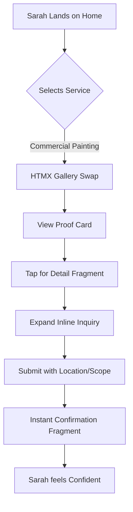
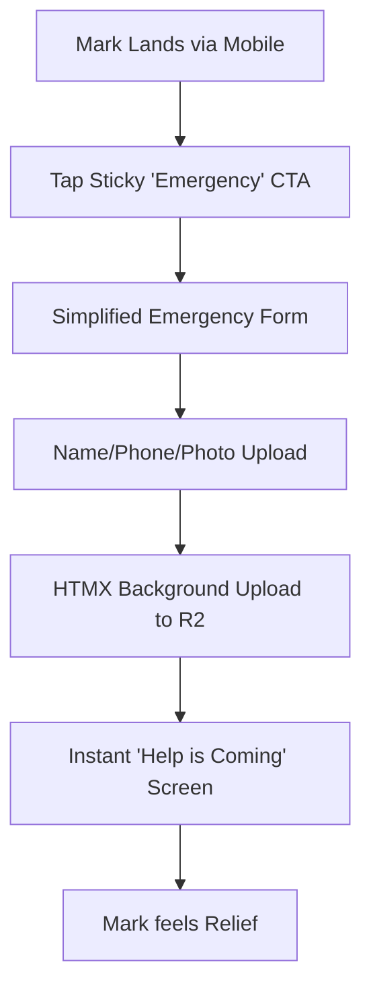
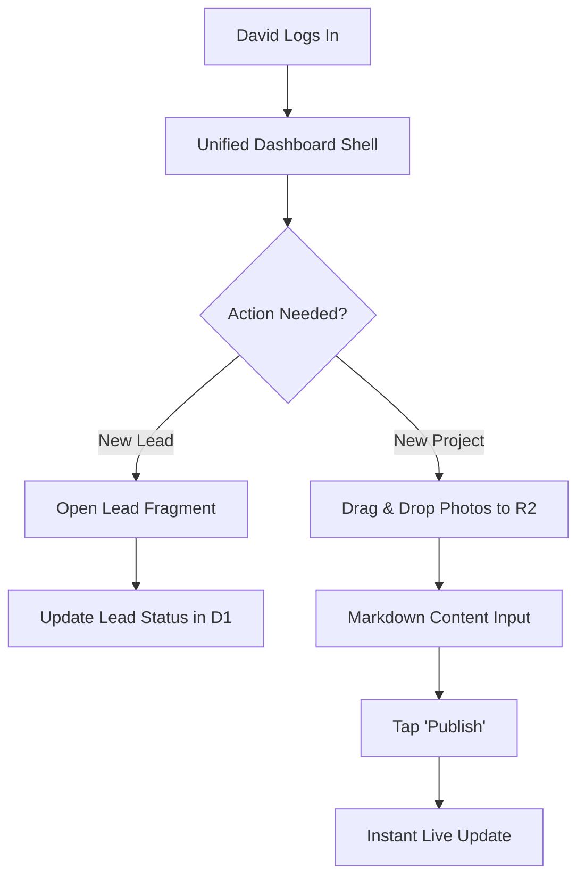

# UX Design Specification exteriorgroup.com.au

**Author:** Hani
**Date:** Fri Jan 16 2026

---

<!-- UX design content will be appended sequentially through collaborative workflow steps -->

## Executive Summary

### Project Vision

Exterior Group is evolving from a legacy static presence into a high-performance digital service platform. The vision is to combine elite edge-native performance (Hono/HTMX) with a premium visual experience that validates the quality of roofing and painting services instantly. The UX must bridge the "trust gap" for high-value strata and commercial clients while remaining frictionless for emergency residential inquiries.

### Target Users

- **Strata & Property Managers (The "Trust & Verify" Sarah)**: Busy professionals needing proof of competency and seamless inquiry paths.
- **Residential Homeowners (The "Midnight Leak" Mark)**: Stressed users on mobile devices requiring instant loading and simple emergency contact forms.
- **Business Operations (The "Project Pride" David)**: Non-technical admin needing an elite management interface to upload media and track business performance.

### Key Design Challenges

- **Media Load Balancing**: Delivering high-resolution "Before & After" proof points without sacrificing the extreme performance targets (LCP < 1.2s).
- **Contextual Friction**: Designing forms that capture deep project requirements (commercial vs residential) without annoying the user.
- **Legacy Evolution**: Modernizing the Bootstrap 5 aesthetic to a custom Tailwind design while maintaining brand recognition.

### Design Opportunities

- **Hypermedia Interactions**: Using HTMX to provide an SPA-like feel for lead capture and gallery filtering without the heavy JS overhead.
- **Interactive Validation**: Real-time project showcases that act as social proof and competency validation.
- **Admin Command Center**: Reusing the borderless-tech analytics dashboard pattern to provide real-time business insights.

## Core User Experience

### Defining Experience

The core experience revolves around the "Trust-to-Inquiry" loop. Users arrive with a maintenance problem and must find immediate, visual proof of Exterior Group's competency through high-performance project showcases. The transition from "Viewing Proof" to "Requesting Consultation" must be the most effortless part of the journey.

### Platform Strategy

- **Edge-Native Web**: Primarily consumed via mobile browsers (Sarah on-site, Mark at home).
- **Responsive Fluidity**: Adaptive layouts using Tailwind CSS that prioritize touch targets and media readability.
- **Hypermedia-Driven**: Utilizing HTMX for all state transitions (filtering, form steps) to ensure a high-fidelity feel without the SPA penalty.

### Effortless Interactions

- **One-Tap Filtering**: Instant, client-side feeling category switches for project types.
- **Invisible Security**: Cloudflare Turnstile integration ensures spam protection without forcing users to solve puzzles.
- **Adaptive Media**: Original quality assets served via R2 proxy, auto-sized for the device to ensure "instant-on" visual impact.

### Critical Success Moments

- **The "Match" Moment**: When a Strata Manager sees a project exactly like their own, loading in under 1 second.
- **The "Confirmed" Moment**: When Mark submits an inquiry and sees an immediate, in-place success fragment without a page reload.
- **The "Admin Pulse"**: When David opens the dashboard and sees lead volume and site performance in a unified view.

### Experience Principles

- **Performance is Reliability**: The site's speed is the primary surrogate for the company's operational speed.
- **Proof-First Navigation**: Reduce text-heavy landing pages in favor of visual competency markers.
- **Conversational Capture**: Forms should feel like a professional intake, not a database entry.
- **Integrated Intelligence**: The borderless-tech analytics pattern ensures the admin experience is data-driven and frictionless.

## Desired Emotional Response

### Primary Emotional Goals

The primary emotional goal is to instill **Unwavering Confidence**. Users (especially strata managers) must feel that Exterior Group is the most professional and capable choice within seconds of landing. For residential users in emergency situations, the secondary goal is **Relief** through speed and simplicity.

### Emotional Journey Mapping

- **Discovery**: "Instant Professionalism." The speed of the edge-native load combined with high-impact visuals creates an immediate sense of scale and reliability.
- **Investigation**: "Validated Competency." As users filter projects, they feel a sense of discovery and proof that their specific problem has been solved before.
- **Conversion**: "Secure Hand-off." Submitting an inquiry feels like handing a problem to a capable partner, reinforced by instant HTMX confirmations.
- **Operations (Admin)**: "Operational Mastery." David feels in control of his business through clear, real-time data visualization.

### Micro-Emotions

- **Trust (Priority 1)**: Built through technical excellence (performance) and visual evidence (R2 media).
- **Calmness**: Achieved through a clean, uncluttered Tailwind UI that prioritizes information hierarchy.
- **Momentum**: Fast UI transitions (HTMX) prevent the "stutter" that causes user anxiety on mobile.

### Design Implications

- **Trust via Performance**: If the site is slow, the user sub-consciously assumes the service is slow. Extreme performance is a trust-building requirement.
- **Visual Proof**: Minimalist typography and generous whitespace are used to frame the project photos, which carry the emotional weight.
- **Interactive Reassurance**: Micro-animations and fragment swaps (HTMX) provide constant feedback that the site is responsive to the user's touch.

### Emotional Design Principles

- **Show, Don't Tell**: Prioritize high-resolution media over superlative-heavy copy.
- **Responsive Calm**: The UI must remain stable and predictable even during heavy media loading.
- **Instant Acknowledgement**: Never leave a user wondering if an action (like a form submission) worked.

## UX Pattern Analysis & Inspiration

### Inspiring Products Analysis

- **Borderless-Tech (Primary Admin Reference)**: The gold standard for the Exterior Group admin experience. Its use of real-time data visualization and efficient CRUD workflows for blog/content management is the blueprint for the new admin panel.
- **Vercel / Next.js Documentation**: Inspiration for the "Edge-Native" feel—ultra-fast typography, predictable navigation, and a sense of "lightness" in the UI.
- **Houzz / Architecture Portfolios**: For the public-facing gallery, Houzz provides excellent patterns for project-based content discovery and visual immersion.

### Transferable UX Patterns

- **HTMX Fragment Navigation**: Instead of page reloads, using partial swaps for filtering project categories (e.g., swapping only the grid items when 'Roofing' is selected).
- **Admin Dashboard Layout**: Reusing the borderless-tech pattern of a collapsible sidebar for navigation and a main content area for SQL-backed analytics and lead lists.
- **Progressive Disclosure Forms**: Breaking the inquiry process into 2-3 logical steps (Service Type -> Location -> Details) to reduce cognitive load on mobile.

### Anti-Patterns to Avoid

- **The Redirection Trap**: Avoiding the standard "Contact Us" page that redirects away from the context of the work. Lead capture should happen inline or as a lightweight overlay.
- **Bootstrap Modal Overload**: Legacy trade sites often hide important details behind clunky modals. We will prioritize inline expansion or separate, fast-loading detail fragments.
- **Heavy Image Payloads**: Never serving un-optimized original photos directly to the mobile user; using the R2 proxy to ensure responsive delivery.

### Design Inspiration Strategy

- **Adopt**: The functional layout and data-viz components from **borderless-tech** for the David (Admin) experience to ensure operational parity.
- **Adapt**: The **Houzz** project discovery feel, but optimized for the 1.2s LCP target by using Hono's server-side fragment rendering.
- **Avoid**: Any design element that requires heavy client-side JavaScript execution, adhering strictly to the HDA (Hypermedia-Driven Application) philosophy.

## Design System Foundation

### 1.1 Design System Choice

**Tailwind CSS + Custom Hypermedia Components (Border-less Pattern)**. We will utilize a themeable, utility-first approach anchored by Tailwind CSS, specifically optimized for Hono JSX and HTMX delivery.

### Rationale for Selection

- **Zero-Runtime Performance**: Essential for meeting the < 1.2s mobile LCP requirement on Cloudflare's edge runtime.
- **Operational Parity**: Enables 1:1 reuse of the functional admin dashboard patterns (sidebar, data-grids, analytics cards) from the **borderless-tech** reference project.
- **Brand Continuity**: Allows for granular control over legacy color mapping (Royal Blue, Slate Grey) while introducing modern spacing and typography.
- **HDA Alignment**: Tailwind's utility-first nature fits perfectly with Hono's server-side fragment rendering, reducing the complexity of client-side CSS management.

### Implementation Approach

- **Component Architecture**: All UI elements will be defined as Hono JSX components, allowing for strict type-safety and server-side logic integration.
- **HTMX Layer**: Interactive states (active navigation, form validation, gallery filtering) will be handled via HTMX attributes embedded directly in the Tailwind-styled markup.
- **Dark Mode**: Native Dark Mode support for the Admin Panel, following the developer-centric aesthetic of borderless-tech.

### Customization Strategy

- **Token Mapping**: Legacy brand colors will be mapped to a custom Tailwind palette (`primary-brand`, `surface-dark`, etc.).
- **Proof-Card Pattern**: A standardized component for project showcases that balances high-res R2 imagery with metadata (category, date, location).
- **Admin Shell**: A consistent layout wrapper for David (Admin) that provides "One-Click" access to leads, blog management, and GA4 telemetry.

## 2. Core User Experience

### 2.1 Defining Experience

**"Instant Proof Match."** The defining moment for Exterior Group is the transition from a user’s specific maintenance problem to seeing visual, high-performance proof of a successful resolution. Users don't just "browse a gallery"; they find their exact solution in under two taps.

### 2.2 User Mental Model

- **Skepticism to Safety**: Users come from a marketplace of fragmented, low-quality trade websites. Their mental model is guarded. They expect to hunt for information and find "generic" stock photos. 
- **The Shift**: By presenting original, high-resolution R2-backed assets instantly, we shift the model from "investigating a contractor" to "selecting a proven solution."

### 2.3 Success Criteria

- **Perceived Zero Latency**: Gallery filtering must feel instantaneous (under 200ms DOM swap).
- **Cognitive Clarity**: A user must be able to identify "Commercial" vs "Residential" work without reading a single word of text.
- **Action Proximity**: The distance between "seeing the proof" and "starting the inquiry" must be minimized—the CTA is always tied to the visual context.

### 2.4 Novel UX Patterns

- **Edge-Filtered Hypermedia**: We are avoiding the standard client-side "JavaScript Filter" anti-pattern. Instead, we use HTMX to swap pre-rendered Hono fragments from the edge. This is novel because it provides an app-like speed without the SEO or bundle-size penalties of a traditional SPA.
- **Admin Command Pattern**: Reusing the borderless-tech pattern of "Direct Action" dashboards, where every lead is visible and actionable from a single, unified command shell.

### 2.5 Experience Mechanics

1.  **Initiation**: Triggered by high-intent "Service Pillars" on the landing page (Roofing, Painting, Strata).
2.  **Interaction**: User selects a pillar; the gallery fragment swaps instantly. User scrolls through "Proof Cards" and taps for deep details.
3.  **Feedback**: Smooth HTMX transitions and skeleton loaders for R2 assets provide constant tactile reassurance.
4.  **Completion**: In-place form submission. No page redirects. Success state replaces the form fragment, maintaining the user's visual context.

## Visual Design Foundation

### Color System

The color system is an evolution of Exterior Group's legacy identity, optimized for digital contrast and high-stakes professionalism.

- **Primary Brand**: `royal-blue` (#003366) — used for primary navigation and core brand identity.
- **Secondary**: `slate-grey` (#4A5568) — used for secondary text and grounding elements.
- **Action/Accent**: `safety-amber` (#D69E2E) — reserved for high-intent actions (e.g., "Request Consultation" or "Emergency Repair").
- **Surface**: `pure-white` (#FFFFFF) for public pages; `deep-charcoal` (#1A202C) for the borderless-tech style Admin Panel.
- **Semantic Mapping**: Standard HDA feedback loops using `green-500` (success), `red-500` (error), and `blue-400` (info).

### Typography System

- **Primary Interface Face**: **Inter**. Selected for its exceptional legibility on high-density mobile screens and its neutral, professional tone.
- **Headings**: **Montserrat**. Semi-bold weights will be used for H1-H3 to provide an authoritative, industrial feel appropriate for structural maintenance.
- **Scale**: A modular 1.25 scale (Major Third).
    - **H1**: 3.052rem (Bold) - Primary Page Titles.
    - **Body**: 1rem (Regular) - Standard reading text.
    - **Caption**: 0.8rem (Medium) - Image metadata and form labels.

### Spacing & Layout Foundation

- **Base Unit**: 4px. All margins, padding, and component heights will be multiples of 4 (4, 8, 12, 16, 24, 32, 48, 64).
- **Public Layout**: Airy and spacious. Utilizing wide gutters (24px) and generous vertical padding (64px+) to allow the project media to breathe.
- **Admin Layout**: High-density utility. Minimalist margins and 8px/12px spacing to maximize information density for lead management, mirroring the **borderless-tech** efficiency.
- **Grid Strategy**: Fluid 12-column grid for desktop; responsive 4-column grid for mobile with simplified stacks.

### Accessibility Considerations

- **Contrast**: All primary/secondary brand text combinations must pass WCAG 2.1 AA (min 4.5:1 ratio).
- **Target Sizes**: Minimum 44px x 44px touch targets for all mobile CTAs.
- **Visual Feedback**: Mandatory focus-visible rings for keyboard users and high-contrast error states for all HTMX form validations.

## Design Direction Decision

### Design Directions Explored

1.  **Immersive Visual (Direction A)**: A media-first approach with full-bleed hero sections and minimal text. Optimized for emotional "wow" factor but sacrificed some operational clarity for complex strata requirements.
2.  **Utility-First (Direction B)**: A dense, list-based approach mirroring an application dashboard. High speed and efficiency, but felt too "cold" for residential trust building.
3.  **The "Edge-Native" Hybrid (Chosen)**: A balanced approach that uses high-contrast Royal Blue headers, wide-gutter masonry grids for project proof, and "Safety Amber" triggers for conversion.

### Chosen Direction

**The "Edge-Native" Hybrid Showcase.** This direction prioritizes the "Instant Proof Match" core experience while maintaining the high-density operational utility required for the Admin experience (borderless-tech parity).

### Design Rationale

- **Balanced Trust**: High-resolution R2 assets provide the emotional proof, while the clean Montserrat headers provide the professional authority.
- **Conversion Focus**: The use of Amber for CTAs ensures that even in a visually rich environment, the "Path to Inquiry" is never lost.
- **HTMX Optimization**: The layout is designed specifically for fragment swapping—ensuring that headers and footers remain stable while the core content morphs instantly between service pillars.
- **Admin Consistency**: By choosing a hybrid direction, the transition from the public site to the Admin dashboard feels like a single, unified system rather than two separate products.

### Implementation Approach

- **Public Navigation**: A top-anchored, Royal Blue bar with white Montserrat links.
- **Project Grid**: Tailwind-based masonry using `aspect-video` for most project cards to ensure consistency.
- **Admin Shell**: A fixed left-sidebar (Deep Charcoal) with active-state Amber indicators, directly reusing the **borderless-tech** navigation logic.
- **Feedback Layer**: Subtle 100ms fade-in transitions for all HTMX-loaded fragments to eliminate "flash of unstyled content" and reinforce the "app-like" feel.

## User Journey Flows

### 1. The "Trust & Verify" Journey (Strata Manager Sarah)

Designed to move from skepticism to safety through rapid proof-of-competency.

### 2. The "Midnight Leak" Journey (Residential Mark)

Designed for extreme mobile speed and high-stress situation reduction.

### 3. Operational Mastery (Admin David)

Directly mirroring the **borderless-tech** efficiency patterns.

### Journey Patterns

- **Contextual Inquiries**: Inquiry forms are never isolated; they are fragments that expand within the context of the project Sarah is viewing.
- **Fragment Morphing**: Navigation between categories doesn't clear state—it morphs the main content area using smooth HTMX transitions.
- **Direct-to-David Logic**: The Admin flow minimizes menus, placing leads and content tools on the primary dashboard surface.

### Flow Optimization Principles

- **Zero-Redirect Conversion**: Users never leave the visual proof to "go to a contact page."
- **Asset-First Entry**: Media loads immediately via R2 proxy, ensuring Sarah sees competency before reading a single word of copy.
- **Mobile Composure**: Emergency flows use large hit-targets and minimized inputs to ensure success in high-stress, mobile environments.

## Component Strategy

### Design System Components

Leveraging Tailwind CSS primitives, we will utilize standardized patterns for:
- **Layout Primitives**: Flexible grids, containers, and spacing utilities.
- **Form Controls**: Base inputs, labels, and Amber-accented buttons.
- **Typography**: Utility classes for Inter and Montserrat scale.

### Custom Components

#### 1. Proof Card (The Competency Marker)
- **Purpose**: Displays a single project showcase in the masonry grid.
- **Anatomy**: R2 image thumbnail, Service Tag, Location, Title, and 'View Proof' overlay.
- **Interactivity**: `hx-get` to load the detailed project fragment.

#### 2. HDA Detail Fragment (Slide-Over)
- **Purpose**: Deep-dive into project specifics without losing Sarah's context.
- **Anatomy**: Multi-image carousel, Markdown content area, inline Inquiry Form.
- **States**: Loading (Skeleton), Expanded, Minimized.

#### 3. Admin Command Shell (Borderless-Tech Clone)
- **Purpose**: The primary interface for David to manage the business.
- **Anatomy**: Fixed sidebar navigation (Deep Charcoal), collapsible groups, and responsive data-viz cards.
- **Interactivity**: Persistent state for the sidebar; HTMX-driven navigation for the main stage.

#### 4. Before/After Interactive Slider
- **Purpose**: High-impact visual proof of restoration quality.
- **Interaction**: Touch-friendly drag handle to compare restoration progress.

#### 5. Resilient Lead Form
- **Purpose**: Frictionless conversion with spam protection.
- **Anatomy**: Field-level HTMX validation, Turnstile verification block, instant success fragment.

### Component Implementation Strategy

- **Hono JSX First**: All components are defined as pure functions, ensuring zero client-side logic for rendering.
- **HTMX Overlay**: Interactivity is added via declarative attributes (`hx-target`, `hx-swap`).
- **Scoped Tailwind**: Utility classes ensure no global CSS side effects while reusing the brand palette.

### Implementation Roadmap

- **Phase 1: Conversion (MVP)**: Resilient Lead Form, Primary Navigation, Service Pillars.
- **Phase 2: Validation (Proof)**: Proof Cards, Masonry Grid, Detail Fragments, Before/After Slider.
- **Phase 3: Operations (Admin)**: Admin Command Shell, Analytics Cards, Lead Management Tables.

## UX Consistency Patterns

### Button Hierarchy

Standardized interaction weights to ensure the "Path to Action" is always unambiguous.

- **Primary Action (Amber)**: Solid `#D69E2E` with white Montserrat bold text. Used exclusively for conversion events (e.g., "Request Consultation").
- **Secondary Action (Blue)**: Ghost or Outlined `#003366`. Used for exploratory navigation (e.g., "View All Projects").
- **Utility (Grey)**: Subtle grey text or icons for low-priority admin functions.

### Feedback Patterns

Declaration of how the system communicates with the user via HDA (HTMX) loops.

- **Immediate Validation**: As soon as a user blurs a form field, HTMX triggers a server-side check. Error states use high-contrast red borders and 0.8rem descriptive captions.
- **Background Persistence**: When David updates a lead status in the Admin panel, a subtle "Saved" checkmark fragment appears inline, eliminating the need for a "Submit" button on every row.
- **Interactive Loading**: Skeleton loaders are used for all project cards during initial fragment fetch to maintain CLS < 0.1 targets.

### Form Patterns

Optimized for data integrity and user composure.

- **Floating Labels**: Used to minimize vertical space on mobile while keeping field context visible.
- **Contextual Help**: Service-specific help text (e.g., "Tell us about your strata roof type") appears only when that category is selected.
- **Safe-Guard Submissions**: Use of HTMX `hx-disabled-elt` to prevent double-submission during the R2 upload process.

### Navigation Patterns

- **Public (Sticky Bottom Bar)**: For mobile users, the 3 pillars (Roofing, Painting, Strata) are anchored to the bottom for one-thumb access, including a prominent Amber "Emergency Call" center button.
- **Admin (The Sidebar)**: Directly reusing the **borderless-tech** fixed-sidebar pattern. Grouped by "Operations" (Leads, Projects) and "Intelligence" (Analytics, Logs).

### Additional Patterns

- **Masonry Skeleton**: Placeholder cards with shimmer animations are served while R2 assets are being proxied through the Worker.
- **Empty States**: Informative "Ready for Work" illustrations in the Admin panel when no leads are present, including a "Manual Entry" shortcut.

## Responsive Design & Accessibility

### Responsive Strategy

Exterior Group utilizes a **Mobile-First Adaptive** strategy, prioritizing the high-stress residential user and the on-site strata manager.

- **Mobile (Primary Target)**: Single-column flow. All primary actions (Emergency, Services, Inquire) are bottom-anchored within thumb reach. High-res imagery occupies 100% width to maximize visual impact.
- **Tablet (Browsing Optimized)**: 2-column masonry grid. Sidebars collapse into top-menus. Sliders and carousels are optimized for multi-touch gestures.
- **Desktop (Admin & Deep Review)**: 12-column expansive layout. Detailed project metrics and multi-pane views for the Admin Command Center (borderless-tech style).

### Breakpoint Strategy

Utilizing standard Tailwind breakpoints with custom containers:
- **`sm` (640px)**: Transition from mobile-stack to small grid.
- **`md` (768px)**: Optimal browsing for Strata managers on iPads.
- **`lg` (1024px)**: Full dashboard experience for David.
- **`xl` (1280px)**: High-fidelity portfolio view for large monitors.

### Accessibility Strategy

Targeting **WCAG 2.1 Level AA** compliance to ensure professional accessibility for all government and corporate strata clients.

- **Visual Clarity**: Minimum contrast ratio of 4.5:1 for all informational text.
- **Touch Intent**: Minimum 44px target area for all interactive elements to prevent "fat-finger" errors on mobile.
- **Aural Navigation**: Semantic HTML5 tags and descriptive ARIA labels for all dynamic HTMX fragment swaps.
- **Cognitive Ease**: Simplified emergency forms with clear, non-jargon instructions.

### Testing Strategy

- **Automated**: Integrated Lighthouse Accessibility audits targeting 95+ score.
- **Manual**: Functional testing on actual iOS/Android devices focusing on the "Midnight Leak" journey.
- **Screen Reader**: Verification of form submission loops using VoiceOver.

### Implementation Guidelines

- **Relative Scaling**: Use `rem` for all typography and `em` for component-relative spacing.
- **Mobile-First Tailwind**: All utility classes should be written for mobile by default, using `md:` and `lg:` modifiers for progressive enhancement.
- **Semantic Structure**: Proper use of `<header>`, `<nav>`, `<main>`, `<section>`, and `<footer>` to ensure predictable document outline for assistive tech.
